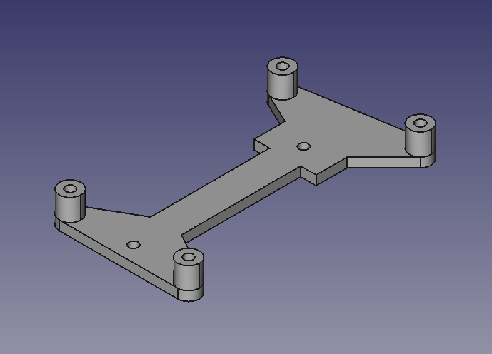

# EscornaCPU-2 bracket

Bracket without ribs 

- [STL](escornacpu2-bracket-b.stl)
- [Freecad Document](escornacpu2-bracket-b.fcstd)

----

Bracket with ribs (to roll the wires)

- [STL](escornacpu2-bracket.stl)
- [Freecad Document](escornacpu2-bracket.fcstd)

