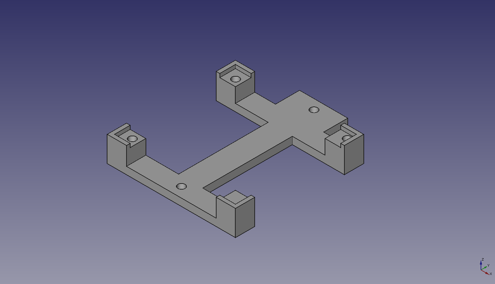

# Soporte Escornabot para botoneira v1

Este é o soporte para [Escornabot Brivoi](http://escornabot.com/web/en/content/history) onde se apoia a placa da botoneira.

Está deseñada para a placa v1 (obsoleta) que teñen 3 buratos asimétricos ainda que vale para calquera placa estándar cadrada de 50.2mm de lado adaptando os eixes dos buratos dos parafusos.

Grazas ás mans de cada esquiña e cunha impresora ben axustada, a placa encaixa sen necesidade de parafusos ainda que son sempre recomendables. Unha pequena gota de pegamento por esquiña é unha alternativa se vai quedar fixa.

Baseado no deseño da [peza orixinal feita por Xoan](https://github.com/escornabot/3dmodel/blob/v0.2/STL/Addon-KeypadBracket-PCB.stl). [Xdesig facilitou as medidas](https://github.com/escornabot/electronics/blob/master/Escorna_botoneira_2_0/Escorna_Shield_botoneira_2_0D_Dimension.png) dos buratos.

  * STL: [keypad-board-v1.stl](keypad-board-v1.stl)
  * FreeCAD: [keypad-board-v1.fcstd](keypad-board-v1.fcstd)
  * STEP: [keypad-board-v1.step](keypad-board-v1.step)

## Modelo do soporte

## Amarre do soporte ao corpo do Escornabot

## Encaixe da placa no soporte

## Placa montada con parafusos

